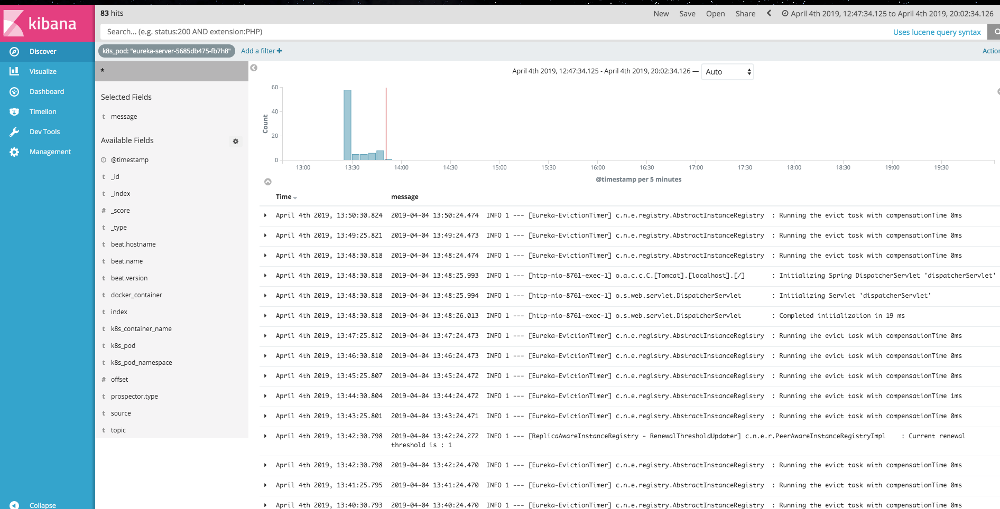

# log-pilot + elasticsearch + kibana kubernetes 日志系统部署

### 需求

> 开发者在面对 kubernetes 分布式集群下的日志需求时，常常会感到头疼，既有容器自身特性的原因，也有现有日志采集工具的桎梏，主要包括：

**容器本身特性：**
- 采集目标多：容器本身的特性导致采集目标多，需要采集容器内日志、容器 stdout。对于容器内部的文件日志采集，现在并没有一个很好的工具能够去动态发现采集。针对每种数据源都有对应的采集软件，但缺乏一站式的工具。

- 弹性伸缩难：kubernetes 是分布式的集群，服务、环境的弹性伸缩对于日志采集带来了很大的困难，无法像传统虚拟机环境下那样，事先配置好日志的采集路径等信息，采集的动态性以及数据完整性是非常大的挑战。

**现有日志工具的一些缺陷**：

- 缺乏动态配置的能力。目前的采集工具都需要事先手动配置好日志采集方式和路径等信息，因为它无法能够自动感知到容器的生命周期变化或者动态漂移，所以它无法动态地去配置。

- 日志采集重复或丢失的问题。因为现在的一些采集工具基本上是通过 tail 的方式来进行日志采集的，那么这里就可能存在两个方面的问题：一个是可能导致日志丢失，比如采集工具在重启的过程中，而应用依然在写日志，那么就有可能导致这个窗口期的日志丢失；而对于这种情况一般保守的做法就是，默认往前多采集 1M 日志或 2M 的日志，那么这就又会可能引起日志采集重复的问题。

- 未明确标记日志源。因为一个应用可能有很多个容器，输出的应用日志也是一样的，那么当我们将所有应用日志收集到统一日志存储后端时，在搜索日志的时候，我们就无法明确这条日志具体是哪一个节点上的哪一个应用容器产生的。

### log-pilot 介绍

> og-Pilot 是一个智能容器日志采集工具，它不仅能够高效便捷地将容器日志采集输出到多种存储日志后端，同时还能够动态地发现和采集容器内部的日志文件。

> 针对前面提出的日志采集难题，log-pilot 通过声明式配置实现强大的容器事件管理，可同时获取容器标准输出和内部文件日志，解决了动态伸缩问题，此外，log-pilot 具有自动发现机制，CheckPoint 及句柄保持的机制，自动日志数据打标，有效应对动态配置、日志重复和丢失以及日志源标记等问题。

目前 log-pilot 在 Github 完全开源，项目地址是 https://github.com/AliyunContainerService/log-pilot 。您可以深入了解更多实现原理。


### 部署log-pilot + elasticsearch + kibana

```shell
[root@ks-master k8s]# git clone https://github.com/baishuchao/kubernetes.git
[root@ks-master k8s]# cd kubernetes/EFK/\ log-pilot\ +\ elasticsearch\ +\ kibana/
[root@ks-master  log-pilot + elasticsearch + kibana]# kubectl apply -f elasticsearch.yml     # 安装elasticsearch集群
[root@ks-master  log-pilot + elasticsearch + kibana]# kubectl apply -f kibana.yml
[root@ks-master  log-pilot + elasticsearch + kibana]# kubectl apply -f log-pilot.yml
[root@ks-master  log-pilot + elasticsearch + kibana]# kubectl apply -f traefik-kibana.yaml

```


### 案例（收集spring-cloud日志）

```yaml
apiVersion: extensions/v1beta1
kind: Deployment
metadata:
  name: eureka-server
spec:
  replicas: 1
  selector:
    matchLabels:
      app: eureka-server
  template:
    metadata:
      labels:
        app: eureka-server
    spec:
      containers:
        - name: eureka-server
          image: registry.cn-hangzhou.aliyuncs.com/cloud-ts/eureka-server:690
          volumeMounts:
          - name: cloud-logs
            mountPath: /logs/cloud
          imagePullPolicy: Always
          env:
           - name: aliyun_logs_pod
             value: "/logs/cloud/*.log"    # 容器日志路径
          ports:
            - containerPort: 8761
      imagePullSecrets:
        - name: registry-secret
      volumes:
      - name: cloud-logs
        emptyDir: {}
```

**部署eureka-server**
```
[root@ks-master  log-pilot + elasticsearch + kibana]# kubectl apply -f eureka.yaml
```


### 见证奇迹的时刻

**访问url http://kibana.baishuchao.com**




