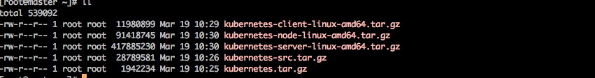

Table of Contents
=================

<!-- TOC -->

- [目录](#目录)
    - [基于二进制部署kubernetes v1.13.4](#基于二进制部署kubernetes-v1134)
        - [1. kubernetes概述](#1-kubernetes概述)
            - [1.1 什么是kubernetes](#11-什么是kubernetes)
            - [1.2 kubernetes的特点](#12-kubernetes的特点)
            - [1.3 kubernetes能做什么](#13-kubernetes能做什么)
            - [1.4 kubernetes核心组件](#14-kubernetes核心组件)
            - [1.5 kubernetes二进制安装包下载](#15-kubernetes二进制安装包下载)
        - [2. kubernetes基础环境部署](#2-kubernetes基础环境部署)
            - [2.1 kubernetes部署节点环境说明](#21-kubernetes部署节点环境说明)
            - [2.2 kubernetes部署前准备](#22-kubernetes部署前准备)
            - [2.3 kubernetes节点系统优化](#23-kubernetes节点系统优化)
            - [2.4 安装Docker-CE](#24-安装docker-ce)
            - [2.5 配置Docker镜像加速](#25-配置docker镜像加速)
        - [3. 创建 CA 证书和秘钥](#3-创建-ca-证书和秘钥)
            - [3.1 安装 cfssl 工具集](#31-安装-cfssl-工具集)
            - [3.2 创建根证书 (CA)](#32-创建根证书-ca)
            - [3.3 生成 CA 证书和私钥](#33-生成-ca-证书和私钥)
            - [3.4 分发证书文件](#34-分发证书文件)
        - [4. 部署 kubectl 客户端工具](#4-部署-kubectl-客户端工具)
            - [4.1 下载和分发 kubectl 二进制文件](#41-下载和分发-kubectl-二进制文件)
            - [4.2 创建 admin 证书和私钥](#42-创建-admin-证书和私钥)
            - [4.3 创建 kubeconfig 文件](#43-创建-kubeconfig-文件)
            - [4.4 分发 kubeconfig 文件](#44-分发-kubeconfig-文件)
        - [5. 部署 etcd 高可用集群](#5-部署-etcd-高可用集群)
            - [5.1 下载和分发 etcd 二进制文件](#51-下载和分发-etcd-二进制文件)
            - [5.2 创建 etcd 证书和私钥](#52-创建-etcd-证书和私钥)
            - [5.3 创建 etcd 的 systemd unit 模板文件](#53-创建-etcd-的-systemd-unit-模板文件)
            - [5.4 为各节点创建和分发 etcd systemd unit 文件](#54-为各节点创建和分发-etcd-systemd-unit-文件)
            - [5.5 启动 etcd 服务](#55-启动-etcd-服务)
            - [5.6 检查启动结果](#56-检查启动结果)
            - [5.7 验证服务状态](#57-验证服务状态)
            - [5.8 查看当前的 leader](#58-查看当前的-leader)
        - [6. 部署 flannel 网络插件](#6-部署-flannel-网络插件)
            - [6.1 下载和分发 flanneld 二进制文件](#61-下载和分发-flanneld-二进制文件)
            - [6.2 创建 flannel 证书和私钥](#62-创建-flannel-证书和私钥)
            - [6.3 向 etcd 写入集群 Pod 网段信息](#63-向-etcd-写入集群-pod-网段信息)
            - [6.4 创建 flanneld 的 systemd unit 文件](#64-创建-flanneld-的-systemd-unit-文件)
            - [6.5 分发 flanneld systemd unit 文件到所有节点](#65-分发-flanneld-systemd-unit-文件到所有节点)
            - [6.6 启动 flanneld 服务](#66-启动-flanneld-服务)
            - [6.7 检查启动结果](#67-检查启动结果)
        - [7. 部署以及分发master安装包](#7-部署以及分发master安装包)
            - [7.1 master节点所需组件](#71-master节点所需组件)
            - [7.2 下载最新版本的二进制文件](#72-下载最新版本的二进制文件)
        - [8. 部署kube-apiserver组件](#8-部署kube-apiserver组件)
            - [8.1 创建 kubernetes 证书和私钥](#81-创建-kubernetes-证书和私钥)
            - [8.2 创建加密配置文件](#82-创建加密配置文件)
            - [8.3 创建 kube-apiserver systemd unit 模板文件](#83-创建-kube-apiserver-systemd-unit-模板文件)
            - [8.4 为各节点创建和分发 kube-apiserver systemd unit 文件](#84-为各节点创建和分发-kube-apiserver-systemd-unit-文件)
            - [8.5 启动 kube-apiserver 服务](#85-启动-kube-apiserver-服务)
            - [8.6 检查 kube-apiserver 运行状态](#86-检查-kube-apiserver-运行状态)
            - [8.7 检查 kube-apiserver 监听的端口](#87-检查-kube-apiserver-监听的端口)
        - [9. 部署 kube-controller-manager 组件](#9-部署-kube-controller-manager-组件)
            - [9.1 创建 kube-controller-manager 证书和私钥](#91-创建-kube-controller-manager-证书和私钥)
            - [9.2 创建和分发 kubeconfig 文件](#92-创建和分发-kubeconfig-文件)
            - [9.3 创建和分发 kube-controller-manager systemd unit 文件](#93-创建和分发-kube-controller-manager-systemd-unit-文件)
            - [9.4  kube-controller-manager 服务](#94--kube-controller-manager-服务)
            - [9.5 检查服务运行状态](#95-检查服务运行状态)
        - [10. 部署 kube-scheduler 组件](#10-部署-kube-scheduler-组件)
            - [10.1 创建 kube-scheduler 证书和私钥](#101-创建-kube-scheduler-证书和私钥)
            - [10.2 创建和分发 kubeconfig 文件](#102-创建和分发-kubeconfig-文件)
            - [10.3 创建 kube-scheduler 配置文件](#103-创建-kube-scheduler-配置文件)
            - [10.4 创建和分发 kube-scheduler systemd unit 文件](#104-创建和分发-kube-scheduler-systemd-unit-文件)
            - [10.5 启动 kube-scheduler 服务](#105-启动-kube-scheduler-服务)
            - [10.6 检查服务运行状态](#106-检查服务运行状态)
        - [11. 部署 kubelet 组件](#11-部署-kubelet-组件)
            - [11.1 安装依赖包](#111-安装依赖包)
            - [11.2 创建 kubelet bootstrap kubeconfig 文件](#112-创建-kubelet-bootstrap-kubeconfig-文件)
            - [11.3 分发 bootstrap kubeconfig 文件到所有 worker 节点](#113-分发-bootstrap-kubeconfig-文件到所有-worker-节点)
            - [11.4 创建和分发 kubelet 参数配置文件](#114-创建和分发-kubelet-参数配置文件)
            - [11.5 创建和分发 kubelet systemd unit 文件.](#115-创建和分发-kubelet-systemd-unit-文件)
            - [11.6 Bootstrap Token Auth 和授予权限](#116-bootstrap-token-auth-和授予权限)
            - [11.7 启动 kubelet 服务](#117-启动-kubelet-服务)
            - [11.8 kubernetes 状态验证](#118-kubernetes-状态验证)
        - [参考文档](#参考文档)

<!-- /TOC -->

# 目录
## 基于二进制部署kubernetes v1.13.4 

### 1. kubernetes概述

#### 1.1 什么是kubernetes

> Kubernetes是容器集群管理系统，是一个开源的平台，可以实现容器集群的自动化部署、自动扩缩容、维护等功能。通过

**Kubernetes你可以：**
- 快速部署应用
- 快速扩展应用
- 无缝对接新的应用功能
- 节省资源，优化硬件资源的使用

> 注：K8s是将Kubernetes的8个字母“ubernete”替换为“8”的缩写。

#### 1.2 kubernetes的特点

- 可移植: 支持公有云，私有云，混合云，多重云（multi-cloud）
- 可扩展: 模块化, 插件化, 可挂载, 可组合
- 自动化: 自动部署，自动重启，自动复制，自动伸缩/扩展

#### 1.3 kubernetes能做什么

- 多个进程（作为容器运行）协同工作。（Pod）
- 存储系统挂载
- 分发敏感文件
- 应用健康检测
- 应用实例的复制
- Pod自动伸缩/扩展
- 务发现
- 负载均衡
- 滚动更新
- 资源监控
- 日志访问
- 调试应用程序
- 提供认证和授权

#### 1.4 kubernetes核心组件

**Kubernetes主要由以下几个核心组件组成:**
- etcd：保存了整个集群的状态；
- apiserver：提供了资源操作的唯一入口，并提供认证、授权、访问控制、API注册和发现等机制；
- controller manager：负责维护集群的状态，比如故障检测、自动扩展、滚动更新等；
- scheduler：负责资源的调度，按照预定的调度策略将Pod调度到相应的机器上；
- kubelet：负责维护容器的生命周期，同时也负责Volume（CVI）和网络（CNI）的管理；
- Container runtime：负责镜像管理以及Pod和容器的真正运行（CRI）；
- kube-proxy：负责为Service提供cluster内部的服务发现和负载均衡；

**除了核心组件，还有一些推荐的Add-ons：**

- kube-dns：负责为整个集群提供DNS服务
- Ingress Controller：为服务提供外网入口
- Heapster：提供资源监控
- Dashboard：提供GUI
- Federation：集群联邦提供跨可用区的集群
- Fluentd-elasticsearch：提供集群日志采集、存储与查询


#### 1.5 kubernetes二进制安装包下载

安装包下载地址： <https://github.com/kubernetes/kubernetes>

需要下载的安装包如下图：



### 2. kubernetes基础环境部署

#### 2.1 kubernetes部署节点环境说明

|            主机名             |   IP Address   |   service   |  
| :------------------: | :-----------------: | :---------------------------------: |  
|     ks-master    |    10.10.11.21    |   docker、etcd、api-server、scheduler、controller-manager、kubelet、flannel   | 
|      ks-node1       |   10.10.11.20    |  docker、etcd、kubelet、proxy、flannel    |
|  ks-node2 |  10.10.11.19|    docker、etcd、kubelet、proxy、flannel  |


**master节点**

> Master节点上面主要由四个模块组成，APIServer，schedule,controller-manager,etcd

> APIServer: APIServer负责对外提供RESTful的kubernetes API的服务，它是系统管理指令的统一接口，任何对资源的增删该查都要交给APIServer处理后再交给etcd，如图，kubectl>(kubernetes提供的客户端工具，该工具内部是对kubernetes API的调用）是直接和APIServer交互的。

>schedule: schedule负责调度Pod到合适的Node上，如果把scheduler看成一个黑匣子，那么它的输入是pod和由多个Node组成的列表，输出是Pod和一个Node的绑定。 kubernetes目前提>供了调度算法，同样也保留了接口。用户根据自己的需求定义自己的调度算法。

>controller manager: 如果APIServer做的是前台的工作的话，那么controller manager就是负责后台的。每一个资源都对应一个控制器。而control manager就是负责管理这些控制器的，比如我们通过APIServer创建了一个Pod，当这个Pod创建成功后，APIServer的任务就算完成了。

>etcd：etcd是一个高可用的键值存储系统，kubernetes使用它来存储各个资源的状态，从而实现了Restful的API。

**node节点**

> 每个Node节点主要由三个模板组成：kublet, kube-proxy

> kube-proxy: 该模块实现了kubernetes中的服务发现和反向代理功能。kube-proxy支持TCP和UDP连接转发，默认基Round Robin算法将客户端流量转发到与service对应的一组后端pod。服务发现方面，kube-proxy使用etcd的watch机制监控集群中service和endpoint对象数据的动态变化，并且维护一个service到endpoint的映射关系，从而保证了后端pod的IP变化不会对访问者造成影响，另外，kube-proxy还支持session affinity。

> kublet：kublet是Master在每个Node节点上面的agent，是Node节点上面最重要的模块，它负责维护和管理该Node上的所有容器，但是如果容器不是通过kubernetes创建的，它并不会管理。本质上，它负责使Pod的运行状态与期望的状态一致。

#### 2.2 kubernetes部署前准备

**配置所有节点主机名**

```
# 配置主机名
[root@ks-master ~]# hostnamectl set-hostname ks-master
[root@ks-node1 ~]# hostnamectl set-hostname ks-node1
[root@ks-node2 ~]# hostnamectl set-hostname ks-node2

# 配置hosts记录

cat <<EOF > /etc/hosts
127.0.0.1   localhost localhost.localdomain localhost4 localhost4.localdomain4
::1         localhost localhost.localdomain localhost6 localhost6.localdomain6
10.10.11.21  ks-master
10.10.11.20  ks-node1
10.10.11.19  ks-node2
EOF

# 配置免密钥登陆

[root@ks-master ~]# ssh-keygen    
Generating public/private rsa key pair.
Enter file in which to save the key (/root/.ssh/id_rsa):
Enter passphrase (empty for no passphrase):
Enter same passphrase again:
Your identification has been saved in /root/.ssh/id_rsa.
Your public key has been saved in /root/.ssh/id_rsa.pub.
The key fingerprint is:
SHA256:fIPG7HsiNiDfQ3e0eITt4tB9mR6JcHNF0di90R1F9rc root@ks-master
The key's randomart image is:
+---[RSA 2048]----+
|             .oBX|
|              ooB|
|         o   .  =|
|       +o.* .  .o|
|       .SOo= + E |
|  . . oo=.B.*    |
|   o + +.+ o .   |
|    . * o.. .    |
|     . +.o       |
+----[SHA256]-----+

[root@ks-master ~]# ssh-copy-id ks-master
[root@ks-master ~]# ssh-copy-id ks-node1
[root@ks-master ~]# ssh-copy-id ks-node2

```

#### 2.3 kubernetes节点系统优化

```
# 关闭防火墙
systemctl stop firewalld
systemctl disable firewalld

# 关闭Swap
swapoff -a 
sed -i 's/.*swap.*/#&/' /etc/fstab

# 禁用Selinux
setenforce  0 
sed -i "s/^SELINUX=enforcing/SELINUX=disabled/g" /etc/sysconfig/selinux 
sed -i "s/^SELINUX=enforcing/SELINUX=disabled/g" /etc/selinux/config 
sed -i "s/^SELINUX=permissive/SELINUX=disabled/g" /etc/sysconfig/selinux 
sed -i "s/^SELINUX=permissive/SELINUX=disabled/g" /etc/selinux/config  

# 报错请参考下面报错处理
modprobe br_netfilter   
cat <<EOF >  /etc/sysctl.d/k8s.conf
net.bridge.bridge-nf-call-ip6tables = 1
net.bridge.bridge-nf-call-iptables = 1
net.ipv4.ip_forward = 1
vm.swappiness=0
EOF
sysctl -p /etc/sysctl.d/k8s.conf
ls /proc/sys/net/bridge

# 内核优化
echo "* soft nofile 204800" >> /etc/security/limits.conf
echo "* hard nofile 204800" >> /etc/security/limits.conf
echo "* soft nproc 204800"  >> /etc/security/limits.conf
echo "* hard nproc 204800"  >> /etc/security/limits.conf
echo "* soft  memlock  unlimited"  >> /etc/security/limits.conf
echo "* hard memlock  unlimited"  >> /etc/security/limits.conf

```
> 注：kubernetes所有节点执行


#### 2.4 安装Docker-CE

```
yum install -y yum-utils device-mapper-persistent-data lvm2
yum-config-manager \
    --add-repo \
    https://download.docker.com/linux/centos/docker-ce.repo

yum makecache fast
yum install -y --setopt=obsoletes=0 \
  docker-ce-18.06.1.ce-3.el7

systemctl start docker
systemctl enable docker
```
> 注：kubernetes所有节点执行

#### 2.5 配置Docker镜像加速

```
sudo mkdir -p /etc/docker
sudo tee /etc/docker/daemon.json <<-'EOF'
{
  "registry-mirrors": ["https://95d2qlt5.mirror.aliyuncs.com"]
}
EOF
sudo systemctl daemon-reload
sudo systemctl restart docker
```

### 3. 创建 CA 证书和秘钥


> 为确保安全，kubernetes 系统各组件需要使用 x509 证书对通信进行加密和认证。

> CA (Certificate Authority) 是自签名的根证书，用来签名后续创建的其它证书。

#### 3.1 安装 cfssl 工具集

```
sudo mkdir -p /opt/k8s/cert && cd /opt/k8s
wget https://pkg.cfssl.org/R1.2/cfssl_linux-amd64
mv cfssl_linux-amd64 /opt/k8s/bin/cfssl

wget https://pkg.cfssl.org/R1.2/cfssljson_linux-amd64
mv cfssljson_linux-amd64 /opt/k8s/bin/cfssljson

wget https://pkg.cfssl.org/R1.2/cfssl-certinfo_linux-amd64
mv cfssl-certinfo_linux-amd64 /opt/k8s/bin/cfssl-certinfo

chmod +x /opt/k8s/bin/*
export PATH=/opt/k8s/bin:$PATH
```
> 注：所有操作在ks-master上执行

#### 3.2 创建根证书 (CA)

> CA 证书是集群所有节点共享的，只需要创建一个 CA 证书，后续创建的所有证书都由它签名。

**创建配置文件**

> CA 配置文件用于配置根证书的使用场景 (profile) 和具体参数 (usage，过期时间、服务端认证、客户端认证、加密等)，后续在签名其它证书时需要指定特定场景。

```
cd /opt/k8s/work
cat > ca-config.json <<EOF
{
  "signing": {
    "default": {
      "expiry": "87600h"
    },
    "profiles": {
      "kubernetes": {
        "usages": [
            "signing",
            "key encipherment",
            "server auth",
            "client auth"
        ],
        "expiry": "87600h"
      }
    }
  }
}
EOF
```
> 注：所有操作在ks-master上执行

- signing：表示该证书可用于签名其它证书，生成的 ca.pem 证书中 CA=TRUE；
- server auth：表示 client 可以用该该证书对 server 提供的证书进行验证；
- client auth：表示 server 可以用该该证书对 client 提供的证书进行验证；

**创建证书签名请求文件**

```
cd /opt/k8s/work
cat > ca-csr.json <<EOF
{
  "CN": "kubernetes",
  "key": {
    "algo": "rsa",
    "size": 2048
  },
  "names": [
    {
      "C": "CN",
      "ST": "BeiJing",
      "L": "BeiJing",
      "O": "k8s",
      "OU": "4Paradigm"
    }
  ]
}
EOF
```
> 注：所有操作在ks-master上执行

- CN：Common Name，kube-apiserver 从证书中提取该字段作为请求的用户名 (User Name)，浏览器使用该字段验证网站是否合法；
- O：Organization，kube-apiserver 从证书中提取该字段作为请求用户所属的组 (Group)；
- kube-apiserver 将提取的 User、Group 作为 RBAC 授权的用户标识；


#### 3.3 生成 CA 证书和私钥

```
cd /opt/k8s/work
cfssl gencert -initca ca-csr.json | cfssljson -bare ca
ls ca*
```
> 注：所有操作在ks-master上执行

#### 3.4 分发证书文件

将生成的 CA 证书、秘钥文件、配置文件拷贝到所有节点的 /etc/kubernetes/cert 目录下：

首先执行此脚本加载变量：[environment.sh](common/environment.sh)

```
cd /opt/k8s/work
source /opt/k8s/bin/environment.sh # 导入 NODE_IPS 环境变量
for node_ip in ${NODE_IPS[@]}
  do
    echo ">>> ${node_ip}"
    ssh root@${node_ip} "mkdir -p /etc/kubernetes/cert"
    scp ca*.pem ca-config.json root@${node_ip}:/etc/kubernetes/cert
  done
```
> 注：所有操作在ks-master上执行

### 4. 部署 kubectl 客户端工具

> kubectl 是 kubernetes 集群的命令行管理工具，kubectl 默认从 ~/.kube/config 文件读取 kube-apiserver 地址、证书、用户名等信息，如果没有配置，执行 kubectl 命令时可能会出错：

```
[root@ks-master bin]# kubectl get pods
The connection to the server 127.0.0.1:8443 was refused - did you specify the right host or port?
```

#### 4.1 下载和分发 kubectl 二进制文件

```
cd /opt/k8s/work
wget https://dl.k8s.io/v1.13.4/kubernetes-client-linux-amd64.tar.gz
tar -xzvf kubernetes-client-linux-amd64.tar.gz


# 分发到所有使用 kubectl 的节点：

cd /opt/k8s/work
source /opt/k8s/bin/environment.sh
for node_ip in ${NODE_IPS[@]}
  do
    echo ">>> ${node_ip}"
    scp kubernetes/client/bin/kubectl root@${node_ip}:/opt/k8s/bin/
    ssh root@${node_ip} "chmod +x /opt/k8s/bin/*"
  done
```
> 注：所有操作在ks-master上执行

#### 4.2 创建 admin 证书和私钥

> kubectl 与 apiserver https 安全端口通信，apiserver 对提供的证书进行认证和授权。

> kubectl 作为集群的管理工具，需要被授予最高权限。这里创建具有最高权限的 admin 证书。

**创建证书签名请求：**

```
cd /opt/k8s/work
cat > admin-csr.json <<EOF
{
  "CN": "admin",
  "hosts": [],
  "key": {
    "algo": "rsa",
    "size": 2048
  },
  "names": [
    {
      "C": "CN",
      "ST": "BeiJing",
      "L": "BeiJing",
      "O": "system:masters",
      "OU": "4Paradigm"
    }
  ]
}
EOF
```
> 注：所有操作在ks-master上执行

- O 为 system:masters，kube-apiserver 收到该证书后将请求的 Group 设置为 system:masters；
- 预定义的 ClusterRoleBinding cluster-admin 将 Group system:masters 与 Role cluster-admin 绑定，该 Role 授予所有 API的权限；
- 该证书只会被 kubectl 当做 client 证书使用，所以 hosts 字段为空；

**生成证书和私钥:**

```
cd /opt/k8s/work
cfssl gencert -ca=/opt/k8s/work/ca.pem \
  -ca-key=/opt/k8s/work/ca-key.pem \
  -config=/opt/k8s/work/ca-config.json \
  -profile=kubernetes admin-csr.json | cfssljson -bare admin

ls admin*
```
> 注：所有操作在ks-master上执行


#### 4.3 创建 kubeconfig 文件

> kubeconfig 为 kubectl 的配置文件，包含访问 apiserver 的所有信息，如 apiserver 地址、CA 证书和自身使用的证书；

```
cd /opt/k8s/work
source /opt/k8s/bin/environment.sh

# 设置集群参数
kubectl config set-cluster kubernetes \
  --certificate-authority=/opt/k8s/work/ca.pem \
  --embed-certs=true \
  --server=${KUBE_APISERVER} \
  --kubeconfig=kubectl.kubeconfig

# 设置客户端认证参数
kubectl config set-credentials admin \
  --client-certificate=/opt/k8s/work/admin.pem \
  --client-key=/opt/k8s/work/admin-key.pem \
  --embed-certs=true \
  --kubeconfig=kubectl.kubeconfig

# 设置上下文参数
kubectl config set-context kubernetes \
  --cluster=kubernetes \
  --user=admin \
  --kubeconfig=kubectl.kubeconfig
  
# 设置默认上下文
kubectl config use-context kubernetes --kubeconfig=kubectl.kubeconfig
```

- --certificate-authority：验证 kube-apiserver 证书的根证书；
- --client-certificate、--client-key：刚生成的 admin 证书和私钥，连接 kube-apiserver 时使用；
- --embed-certs=true：将 ca.pem 和 admin.pem 证书内容嵌入到生成的 kubectl.kubeconfig 文件中(不加时，写入的是证书文件路径)；

> 注：所有操作在ks-master上执行


#### 4.4 分发 kubeconfig 文件

> 分发到所有使用 kubectl 命令的节点：

```
cd /opt/k8s/work
source /opt/k8s/bin/environment.sh
for node_ip in ${NODE_IPS[@]}
  do
    echo ">>> ${node_ip}"
    ssh root@${node_ip} "mkdir -p ~/.kube"
    scp kubectl.kubeconfig root@${node_ip}:~/.kube/config
  done
```
> 注：所有操作在ks-master上执行

### 5. 部署 etcd 高可用集群

etcd 是基于 Raft 的分布式 key-value 存储系统，由 CoreOS 开发，常用于服务发现、共享配置以及并发控制（如 leader 选举、分布式锁等）。kubernetes 使用 etcd 存储所有运行数据。

etcd 集群各节点的名称和 IP 如下：

- ks-master：10.10.11.21
- ks-node1：10.10.11.20
- ks-node2：10.10.11.19
> 注：所有操作在ks-master上执行

#### 5.1 下载和分发 etcd 二进制文件

```
cd /opt/k8s/work
wget https://github.com/coreos/etcd/releases/download/v3.3.10/etcd-v3.3.10-linux-amd64.tar.gz
tar -xvf etcd-v3.3.10-linux-amd64.tar.gz


# 分发二进制文件到集群所有节点

cd /opt/k8s/work
source /opt/k8s/bin/environment.sh
for node_ip in ${NODE_IPS[@]}
  do
    echo ">>> ${node_ip}"
    scp etcd-v3.3.10-linux-amd64/etcd* root@${node_ip}:/opt/k8s/bin
    ssh root@${node_ip} "chmod +x /opt/k8s/bin/*"
  done

```

> 注：所有操作在ks-master上执行


#### 5.2 创建 etcd 证书和私钥

**创建证书签名请求：**

```
cat > etcd-csr.json <<EOF
{
  "CN": "etcd",
  "hosts": [
    "127.0.0.1",
    "10.10.11.21",
    "10.10.11.20",
    "10.10.11.19"
  ],
  "key": {
    "algo": "rsa",
    "size": 2048
  },
  "names": [
    {
      "C": "CN",
      "ST": "BeiJing",
      "L": "BeiJing",
      "O": "k8s",
      "OU": "4Paradigm"
    }
  ]
}
EOF
```

> 注：所有操作在ks-master上执行

- hosts 字段指定授权使用该证书的 etcd 节点 IP 或域名列表，这里将 etcd 集群的三个节点 IP 都列在其中；


**生成证书和私钥：**

```
cd /opt/k8s/work
cfssl gencert -ca=/opt/k8s/work/ca.pem \
    -ca-key=/opt/k8s/work/ca-key.pem \
    -config=/opt/k8s/work/ca-config.json \
    -profile=kubernetes etcd-csr.json | cfssljson -bare etcd
ls etcd*pem
```

> 注：所有操作在ks-master上执行

**分发生成的证书和私钥到各 etcd 节点：**

```
cd /opt/k8s/work
source /opt/k8s/bin/environment.sh
for node_ip in ${NODE_IPS[@]}
  do
    echo ">>> ${node_ip}"
    ssh root@${node_ip} "mkdir -p /etc/etcd/cert"
    scp etcd*.pem root@${node_ip}:/etc/etcd/cert/
  done

```
> 注：所有操作在ks-master上执行

#### 5.3 创建 etcd 的 systemd unit 模板文件

```
cd /opt/k8s/work
source /opt/k8s/bin/environment.sh
cat > etcd.service.template <<EOF
[Unit]
Description=Etcd Server
After=network.target
After=network-online.target
Wants=network-online.target
Documentation=https://github.com/coreos

[Service]
Type=notify
WorkingDirectory=${ETCD_DATA_DIR}
ExecStart=/opt/k8s/bin/etcd \\
  --data-dir=${ETCD_DATA_DIR} \\
  --wal-dir=${ETCD_WAL_DIR} \\
  --name=##NODE_NAME## \\
  --cert-file=/etc/etcd/cert/etcd.pem \\
  --key-file=/etc/etcd/cert/etcd-key.pem \\
  --trusted-ca-file=/etc/kubernetes/cert/ca.pem \\
  --peer-cert-file=/etc/etcd/cert/etcd.pem \\
  --peer-key-file=/etc/etcd/cert/etcd-key.pem \\
  --peer-trusted-ca-file=/etc/kubernetes/cert/ca.pem \\
  --peer-client-cert-auth \\
  --client-cert-auth \\
  --listen-peer-urls=https://##NODE_IP##:2380 \\
  --initial-advertise-peer-urls=https://##NODE_IP##:2380 \\
  --listen-client-urls=https://##NODE_IP##:2379,http://127.0.0.1:2379 \\
  --advertise-client-urls=https://##NODE_IP##:2379 \\
  --initial-cluster-token=etcd-cluster-0 \\
  --initial-cluster=${ETCD_NODES} \\
  --initial-cluster-state=new \\
  --auto-compaction-mode=periodic \\
  --auto-compaction-retention=1 \\
  --max-request-bytes=33554432 \\
  --quota-backend-bytes=6442450944 \\
  --heartbeat-interval=250 \\
  --election-timeout=2000
Restart=on-failure
RestartSec=5
LimitNOFILE=65536

[Install]
WantedBy=multi-user.target
EOF
```

> 注：所有操作在ks-master上执行

- WorkingDirectory、--data-dir：指定工作目录和数据目录为 ${ETCD_DATA_DIR}，需在启动服务前创建这个目录；
- --wal-dir：指定 wal 目录，为了提高性能，一般使用 SSD 或者和 --data-dir 不同的磁盘；
- --name：指定节点名称，当 --initial-cluster-state 值为 new 时，--name 的参数值必须位于 --initial-cluster 列表中；
- --cert-file、--key-file：etcd server 与 client 通信时使用的证书和私钥；
- --trusted-ca-file：签名 client 证书的 CA 证书，用于验证 client 证书；
- --peer-cert-file、--peer-key-file：etcd 与 peer 通信使用的证书和私钥；
- --peer-trusted-ca-file：签名 peer 证书的 CA 证书，用于验证 peer 证书；

#### 5.4 为各节点创建和分发 etcd systemd unit 文件

**替换模板文件中的变量，为各节点创建 systemd unit 文件：**

```
cd /opt/k8s/work
source /opt/k8s/bin/environment.sh
for (( i=0; i < 3; i++ ))
  do
    sed -e "s/##NODE_NAME##/${NODE_NAMES[i]}/" -e "s/##NODE_IP##/${NODE_IPS[i]}/" etcd.service.template > etcd-${NODE_IPS[i]}.service 
  done
ls *.service
```

> 注：所有操作在ks-master上执行

* NODE_NAMES 和 NODE_IPS 为相同长度的 bash 数组，分别为节点名称和对应的 IP；

**分发生成的 systemd unit 文件：**

```
cd /opt/k8s/work
source /opt/k8s/bin/environment.sh
for node_ip in ${NODE_IPS[@]}
  do
    echo ">>> ${node_ip}"
    scp etcd-${node_ip}.service root@${node_ip}:/etc/systemd/system/etcd.service
  done
```
> 注：所有操作在ks-master上执行


[etcd.service](common/etcd.service)


#### 5.5 启动 etcd 服务

```
cd /opt/k8s/work
source /opt/k8s/bin/environment.sh
for node_ip in ${NODE_IPS[@]}
  do
    echo ">>> ${node_ip}"
    ssh root@${node_ip} "mkdir -p ${ETCD_DATA_DIR} ${ETCD_WAL_DIR}"
    ssh root@${node_ip} "systemctl daemon-reload && systemctl enable etcd && systemctl restart etcd " &
  done
```

> 注：所有操作在ks-master上执行

- 必须创建 etcd 数据目录和工作目录;
- etcd 进程首次启动时会等待其它节点的 etcd 加入集群，命令 systemctl start etcd 会卡住一段时间，为正常现象。

#### 5.6 检查启动结果

```
cd /opt/k8s/work
source /opt/k8s/bin/environment.sh
for node_ip in ${NODE_IPS[@]}
  do
    echo ">>> ${node_ip}"
    ssh root@${node_ip} "systemctl status etcd|grep Active"
  done

# 执行结果
>>> 10.10.11.21
   Active: active (running) since Tue 2019-03-19 15:55:22 CST; 1h 26min ago
>>> 10.10.11.20
   Active: active (running) since Tue 2019-03-19 15:55:11 CST; 1h 26min ago
>>> 10.10.11.19
   Active: active (running) since Tue 2019-03-19 15:55:11 CST; 1h 26min ago


```

> 注：所有操作在ks-master上执行

#### 5.7 验证服务状态

**部署完 etcd 集群后，在任一 etc 节点上执行如下命令：**

```
cd /opt/k8s/work
source /opt/k8s/bin/environment.sh
for node_ip in ${NODE_IPS[@]}
  do
    echo ">>> ${node_ip}"
    ETCDCTL_API=3 /opt/k8s/bin/etcdctl \
    --endpoints=https://${node_ip}:2379 \
    --cacert=/opt/k8s/work/ca.pem \
    --cert=/etc/etcd/cert/etcd.pem \
    --key=/etc/etcd/cert/etcd-key.pem endpoint health
  done

# 执行结果

>>> 10.10.11.21
https://10.10.11.21:2379 is healthy: successfully committed proposal: took = 1.997671ms
>>> 10.10.11.20
https://10.10.11.20:2379 is healthy: successfully committed proposal: took = 1.289626ms
>>> 10.10.11.19
https://10.10.11.19:2379 is healthy: successfully committed proposal: took = 1.663937ms
```
> 注：所有操作在ks-master上执行


#### 5.8 查看当前的 leader

```
source /opt/k8s/bin/environment.sh
ETCDCTL_API=3 /opt/k8s/bin/etcdctl \
  -w table --cacert=/opt/k8s/work/ca.pem \
  --cert=/etc/etcd/cert/etcd.pem \
  --key=/etc/etcd/cert/etcd-key.pem \
  --endpoints=${ETCD_ENDPOINTS} endpoint status 

# 结果

+--------------------------+------------------+---------+---------+-----------+-----------+------------+
|         ENDPOINT         |        ID        | VERSION | DB SIZE | IS LEADER | RAFT TERM | RAFT INDEX |
+--------------------------+------------------+---------+---------+-----------+-----------+------------+
| https://10.10.11.21:2379 | a5819d9a1318a6fd |  3.3.10 |   20 kB |     false |         5 |         15 |
| https://10.10.11.20:2379 | 41f7138582b5f2c2 |  3.3.10 |   20 kB |      true |         5 |         15 |
| https://10.10.11.19:2379 | 97f11d52a9bffebb |  3.3.10 |   20 kB |     false |         5 |         15 |
+--------------------------+------------------+---------+---------+-----------+-----------+------------+
```

> 注：IS LEADER 为true，则为leader

> 注：所有操作在ks-master上执行

### 6. 部署 flannel 网络插件

> 由于所有的node节点都需要安装网络插件才能让所有的Pod加入到同一个局域网中，kubernetes 要求集群内各节点(包括 master 节点)能通过 Pod 网段互联互通。flannel 使用 vxlan 技术为各节点创建一个可以互通的 Pod 网络，使用的端口为 UDP 8472，需要开放该端口（如公有云 AWS 等）。

> flannel 第一次启动时，从 etcd 获取 Pod 网段信息，为本节点分配一个未使用的地址段，然后创建 flannedl.1（也可能是其它名称，如 flannel1 等） 接口。

> flannel 将分配的 Pod 网段信息写入 /run/flannel/docker 文件，docker 后续使用这个文件中的环境变量设置 docker0 网桥。

#### 6.1 下载和分发 flanneld 二进制文件

https://github.com/coreos/flannel/releases 页面下载最新版本的发布包：

```
cd /opt/k8s/work
mkdir flannel
wget https://github.com/coreos/flannel/releases/download/v0.10.0/flannel-v0.10.0-linux-amd64.tar.gz
tar -xzvf flannel-v0.10.0-linux-amd64.tar.gz -C flannel

# 分发 flanneld 二进制文件到集群所有节点
cd /opt/k8s/work
source /opt/k8s/bin/environment.sh
for node_ip in ${NODE_IPS[@]}
  do
    echo ">>> ${node_ip}"
    scp flannel/{flanneld,mk-docker-opts.sh} root@${node_ip}:/opt/k8s/bin/
    ssh root@${node_ip} "chmod +x /opt/k8s/bin/*"
  done
```

> 注：所有操作在ks-master上执行

#### 6.2 创建 flannel 证书和私钥

> flannel 从 etcd 集群存取网段分配信息，而 etcd 集群启用了双向 x509 证书认证，所以需要为 flanneld 生成证书和私钥。

**创建证书签名请求：**

```
cd /opt/k8s/work
cat > flanneld-csr.json <<EOF
{
  "CN": "flanneld",
  "hosts": [],
  "key": {
    "algo": "rsa",
    "size": 2048
  },
  "names": [
    {
      "C": "CN",
      "ST": "BeiJing",
      "L": "BeiJing",
      "O": "k8s",
      "OU": "4Paradigm"
    }
  ]
}
EOF
```


> 注：该证书只会被 kubectl 当做 client 证书使用，所以 hosts 字段为空；

**生成证书和私钥：**

```
cfssl gencert -ca=/opt/k8s/work/ca.pem \
  -ca-key=/opt/k8s/work/ca-key.pem \
  -config=/opt/k8s/work/ca-config.json \
  -profile=kubernetes flanneld-csr.json | cfssljson -bare flanneld
ls flanneld*pem


# 将生成的证书和私钥分发到所有节点（master 和 worker）

cd /opt/k8s/work
source /opt/k8s/bin/environment.sh
for node_ip in ${NODE_IPS[@]}
  do
    echo ">>> ${node_ip}"
    ssh root@${node_ip} "mkdir -p /etc/flanneld/cert"
    scp flanneld*.pem root@${node_ip}:/etc/flanneld/cert
  done


```

> 注：所有操作在ks-master上执行


#### 6.3 向 etcd 写入集群 Pod 网段信息

```
cd /opt/k8s/work
source /opt/k8s/bin/environment.sh
etcdctl \
  --endpoints=${ETCD_ENDPOINTS} \
  --ca-file=/opt/k8s/work/ca.pem \
  --cert-file=/opt/k8s/work/flanneld.pem \
  --key-file=/opt/k8s/work/flanneld-key.pem \
  set ${FLANNEL_ETCD_PREFIX}/config '{"Network":"'${CLUSTER_CIDR}'", "SubnetLen": 21, "Backend": {"Type": "vxlan"}}'

```

- lanneld 当前版本 (v0.10.0) 不支持 etcd v3，故使用 etcd v2 API 写入配置 key 和网段数据；
- 写入的 Pod 网段 ${CLUSTER_CIDR} 地址段如 /16 必须小于 SubnetLen，必须与 kube-controller-manager 的 --cluster-cidr 参数值一致；

> 注：所有操作在ks-master上执行


#### 6.4 创建 flanneld 的 systemd unit 文件

```
cd /opt/k8s/work
source /opt/k8s/bin/environment.sh
cat > flanneld.service << EOF
[Unit]
Description=Flanneld overlay address etcd agent
After=network.target
After=network-online.target
Wants=network-online.target
After=etcd.service
Before=docker.service

[Service]
Type=notify
ExecStart=/opt/k8s/bin/flanneld \\
  -etcd-cafile=/etc/kubernetes/cert/ca.pem \\
  -etcd-certfile=/etc/flanneld/cert/flanneld.pem \\
  -etcd-keyfile=/etc/flanneld/cert/flanneld-key.pem \\
  -etcd-endpoints=${ETCD_ENDPOINTS} \\
  -etcd-prefix=${FLANNEL_ETCD_PREFIX} \\
  -iface=${IFACE} \\
  -ip-masq
ExecStartPost=/opt/k8s/bin/mk-docker-opts.sh -k DOCKER_NETWORK_OPTIONS -d /run/flannel/docker
Restart=always
RestartSec=5
StartLimitInterval=0

[Install]
WantedBy=multi-user.target
RequiredBy=docker.service
EOF
```

> 注：所有操作在ks-master上执行

- mk-docker-opts.sh 脚本将分配给 flanneld 的 Pod 子网网段信息写入 /run/flannel/docker 文件，后续 docker 启动时使用这个文件中的环境变量配置 docker0 网桥；
- flanneld 使用系统缺省路由所在的接口与其它节点通信，对于有多个网络接口（如内网和公网）的节点，可以用 -iface 参数指定通信接口;
- flanneld 运行时需要 root 权限；
- -ip-masq: flanneld 为访问 Pod 网络外的流量设置 SNAT 规则，同时将传递给 Docker 的变量 --ip-masq（/run/flannel/docker 文件中）设置为 false，这样 Docker 将不再创建 SNAT 规则； Docker 的 --ip-masq 为 true 时，创建的 SNAT 规则比较“暴力”：将所有本节点 Pod 发起的、访问非 docker0 接口的请求做 SNAT，这样访问其他节点 Pod 的请求来源 IP 会被设置为 flannel.1 接口的 IP，导致目的 Pod 看不到真实的来源 Pod IP。 flanneld 创建的 SNAT 规则比较温和，只对访问非 Pod 网段的请求做 SNAT。


#### 6.5 分发 flanneld systemd unit 文件到所有节点

```
source /opt/k8s/bin/environment.sh
for node_ip in ${NODE_IPS[@]}
  do
    echo ">>> ${node_ip}"
    scp flanneld.service root@${node_ip}:/etc/systemd/system/
  done
```

> 注：所有操作在ks-master上执行

[flanneld.service](common/flanneld.service)

#### 6.6 启动 flanneld 服务

```
source /opt/k8s/bin/environment.sh
for node_ip in ${NODE_IPS[@]}
  do
    echo ">>> ${node_ip}"
    ssh root@${node_ip} "systemctl daemon-reload && systemctl enable flanneld && systemctl restart flanneld"
  done
```

> 注：所有操作在ks-master上执行

#### 6.7 检查启动结果

```
source /opt/k8s/bin/environment.sh
for node_ip in ${NODE_IPS[@]}
  do
    echo ">>> ${node_ip}"
    ssh root@${node_ip} "systemctl status flanneld|grep Active"
  done
```

> 注：所有操作在ks-master上执行


### 7. 部署以及分发master安装包

#### 7.1 master节点所需组件

**kubernetes master 节点运行如下组件：**

- kube-apiserver
- kube-scheduler
- kube-controller-manager

> 注：
> kube-scheduler、kube-controller-manager 和 kube-apiserver 三者的功能紧密相关；
> 同时只能有一个 kube-scheduler、kube-controller-manager 进程处于工作状态，如果运行多个，则需要通过选举产生一个 leader；

#### 7.2 下载最新版本的二进制文件

```
cd /opt/k8s/work
wget https://dl.k8s.io/v1.13.4/kubernetes-server-linux-amd64.tar.gz
tar -xzvf kubernetes-server-linux-amd64.tar.gz
cd kubernetes
tar -xzvf  kubernetes-src.tar.gz


# 将二进制文件拷贝到 master 节点：

cd /opt/k8s/work/kubernetes
source /opt/k8s/bin/environment.sh
for master_ip in ${MASTER_IPS[@]}
  do
    echo ">>> ${MASTER_IPS}"
    scp server/bin/* root@${master_ip}:/opt/k8s/bin/
    ssh root@${master_ip} "chmod +x /opt/k8s/bin/*"
  done


```

> 注：所有操作在ks-master上执行


### 8. 部署kube-apiserver组件

#### 8.1 创建 kubernetes 证书和私钥

**创建证书签名请求**

```
cd /opt/k8s/work
source /opt/k8s/bin/environment.sh
cat > kubernetes-csr.json <<EOF
{
  "CN": "kubernetes",
  "hosts": [
    "127.0.0.1",
    "10.10.11.21",
    "${CLUSTER_KUBERNETES_SVC_IP}",
    "kubernetes",
    "kubernetes.default",
    "kubernetes.default.svc",
    "kubernetes.default.svc.cluster",
    "kubernetes.default.svc.cluster.local"
  ],
  "key": {
    "algo": "rsa",
    "size": 2048
  },
  "names": [
    {
      "C": "CN",
      "ST": "BeiJing",
      "L": "BeiJing",
      "O": "k8s",
      "OU": "4Paradigm"
    }
  ]
}
EOF

```

> 注：json文件内环境变量读[environment.sh](common/environment.sh)


- hosts 字段指定授权使用该证书的 IP 或域名列表，这里列出了 VIP 、apiserver 节点 IP、kubernetes 服务 IP 和域名；

- 域名最后字符不能是 .(如不能为 kubernetes.default.svc.cluster.local.)，否则解析时失败，提示： x509: cannot parse dnsName "kubernetes.default.svc.cluster.local."；

- 如果使用非 cluster.local 域名，如 opsnull.com，则需要修改域名列表中的最后两个域名为：kubernetes.default.svc.opsnull、kubernetes.default.svc.opsnull.com

- kubernetes 服务 IP 是 apiserver 自动创建的，一般是 --service-cluster-ip-range 参数指定的网段的第一个IP，后续可以通过如下命令获取：

```
[root@ks-master ~]# kubectl get svc kubernetes
NAME         TYPE        CLUSTER-IP   EXTERNAL-IP   PORT(S)   AGE
kubernetes   ClusterIP   10.254.0.1   <none>        443/TCP   26h

```

**生成证书和私钥：**

```
cfssl gencert -ca=/opt/k8s/work/ca.pem \
  -ca-key=/opt/k8s/work/ca-key.pem \
  -config=/opt/k8s/work/ca-config.json \
  -profile=kubernetes kubernetes-csr.json | cfssljson -bare kubernetes
ls kubernetes*pem
```

**将生成的证书和私钥文件拷贝到 master 节点：**

```
cd /opt/k8s/work
source /opt/k8s/bin/environment.sh
for node_ip in ${MASTER_IPS[@]}
  do
    echo ">>> ${master_ip}"
    ssh root@${master_ip} "mkdir -p /etc/kubernetes/cert"
    scp kubernetes*.pem root@${master_ip}:/etc/kubernetes/cert/
  done
```


#### 8.2 创建加密配置文件

```
cd /opt/k8s/work
source /opt/k8s/bin/environment.sh
cat > encryption-config.yaml <<EOF
kind: EncryptionConfig
apiVersion: v1
resources:
  - resources:
      - secrets
    providers:
      - aescbc:
          keys:
            - name: key1
              secret: ${ENCRYPTION_KEY}
      - identity: {}
EOF
```


**将加密配置文件拷贝到 master 节点的 /etc/kubernetes 目录下：**

```
cd /opt/k8s/work
source /opt/k8s/bin/environment.sh
for master_ip in ${MASTER_IPS[@]}
  do
    echo ">>> ${master_ip}"
    scp encryption-config.yaml root@${master_ip}:/etc/kubernetes/
  done
```

[encryption-config.yaml](common/encryption-config.yaml)


#### 8.3 创建 kube-apiserver systemd unit 模板文件

```
cd /opt/k8s/work
source /opt/k8s/bin/environment.sh
cat > kube-apiserver.service.template <<EOF
[Unit]
Description=Kubernetes API Server
Documentation=https://github.com/GoogleCloudPlatform/kubernetes
After=network.target

[Service]
WorkingDirectory=${K8S_DIR}/kube-apiserver
ExecStart=/opt/k8s/bin/kube-apiserver \\
  --enable-admission-plugins=Initializers,NamespaceLifecycle,NodeRestriction,LimitRanger,ServiceAccount,DefaultStorageClass,ResourceQuota \\
  --anonymous-auth=false \\
  --experimental-encryption-provider-config=/etc/kubernetes/encryption-config.yaml \\
  --advertise-address=##MASTER_IP## \\
  --bind-address=##MASTER_IP## \\
  --insecure-port=0 \\
  --authorization-mode=Node,RBAC \\
  --runtime-config=api/all \\
  --enable-bootstrap-token-auth \\
  --service-cluster-ip-range=${SERVICE_CIDR} \\
  --service-node-port-range=${NODE_PORT_RANGE} \\
  --tls-cert-file=/etc/kubernetes/cert/kubernetes.pem \\
  --tls-private-key-file=/etc/kubernetes/cert/kubernetes-key.pem \\
  --client-ca-file=/etc/kubernetes/cert/ca.pem \\
  --kubelet-certificate-authority=/etc/kubernetes/cert/ca.pem \\
  --kubelet-client-certificate=/etc/kubernetes/cert/kubernetes.pem \\
  --kubelet-client-key=/etc/kubernetes/cert/kubernetes-key.pem \\
  --kubelet-https=true \\
  --service-account-key-file=/etc/kubernetes/cert/ca.pem \\
  --etcd-cafile=/etc/kubernetes/cert/ca.pem \\
  --etcd-certfile=/etc/kubernetes/cert/kubernetes.pem \\
  --etcd-keyfile=/etc/kubernetes/cert/kubernetes-key.pem \\
  --etcd-servers=${ETCD_ENDPOINTS} \\
  --enable-swagger-ui=true \\
  --allow-privileged=true \\
  --max-mutating-requests-inflight=2000 \\
  --max-requests-inflight=4000 \\
  --apiserver-count=3 \\
  --audit-log-maxage=30 \\
  --audit-log-maxbackup=3 \\
  --audit-log-maxsize=100 \\
  --audit-log-path=${K8S_DIR}/kube-apiserver/audit.log \\
  --event-ttl=168h \\
  --logtostderr=true \\
  --v=2
Restart=on-failure
RestartSec=5
Type=notify
LimitNOFILE=65536

[Install]
WantedBy=multi-user.target
EOF
```


- --experimental-encryption-provider-config：启用加密特性；
- --authorization-mode=Node,RBAC： 开启 Node 和 RBAC 授权模式，拒绝未授权的请求；
- --enable-admission-plugins：启用 ServiceAccount 和 NodeRestriction；
- --service-account-key-file：签名 ServiceAccount Token 的公钥文件，kube-controller-manager 的 --service-account-private-key-file 指定私钥文件，两者配对使用；
- --tls-*-file：指定 apiserver 使用的证书、私钥和 CA 文件。--client-ca-file 用于验证 client (kue-controller-manager、kube-scheduler、kubelet、kube-proxy 等)请求所带的证书；
- --kubelet-client-certificate、--kubelet-client-key：如果指定，则使用 https 访问 kubelet APIs；需要为证书对应的用户(上面 kubernetes*.pem 证书的用户为 kubernetes) 用户定义 RBAC 规则，否则访问 kubelet API 时提示未授权；
- --bind-address： 不能为 127.0.0.1，否则外界不能访问它的安全端口 6443；
- --insecure-port=0：关闭监听非安全端口(8080)；
- --service-cluster-ip-range： 指定 Service Cluster IP 地址段；
- --service-node-port-range： 指定 NodePort 的端口范围；
- --runtime-config=api/all=true： 启用所有版本的 APIs，如 autoscaling/v2alpha1；
- --enable-bootstrap-token-auth：启用 kubelet bootstrap 的 token 认证；
- --apiserver-count=3：指定集群运行模式，多台 kube-apiserver 会通过 leader 选举产生一个工作节点，其它节点处于阻塞状态；


[kube-apiserver.service](kube-apiserver.service)

> 注：如启动失败，则参考如上配置文件

> 注：所有操作在ks-master上执行


#### 8.4 为各节点创建和分发 kube-apiserver systemd unit 文件

**替换模板文件中的变量，为各节点创建 systemd unit 文件：**

```
cd /opt/k8s/work
source /opt/k8s/bin/environment.sh
for (( i=0; i < 3; i++ ))
  do
    sed -e "s/##MASTER_NAME##/${MASTER_NAMES[i]}/" -e "s/##MASTER_IP##/${MASTER_IPS[i]}/" kube-apiserver.service.template > kube-apiserver-${MASTER_IPS[i]}.service 
  done
ls kube-apiserver*.service
```
- NODE_NAMES 和 NODE_IPS 为相同长度的 bash 数组，分别为节点名称和对应的 IP；


> 注：所有操作在ks-master上执行


**分发生成的 systemd unit 文件：**

```
cd /opt/k8s/work
source /opt/k8s/bin/environment.sh
for master_ip in ${MASTER_IPS[@]}
  do
    echo ">>> ${master_ip}"
    scp kube-apiserver-${master_ip}.service root@${master_ip}:/etc/systemd/system/kube-apiserver.service
  done
```
#### 8.5 启动 kube-apiserver 服务

```
source /opt/k8s/bin/environment.sh
for master_ip in ${MASTER_IPS[@]}
  do
    echo ">>> ${master_ip}"
    ssh root@${master_ip} "mkdir -p ${K8S_DIR}/kube-apiserver"
    ssh root@${master_ip} "systemctl daemon-reload && systemctl enable kube-apiserver && systemctl restart kube-apiserver"
  done
```

> 注：所有操作在ks-master上执行

#### 8.6 检查 kube-apiserver 运行状态

```
source /opt/k8s/bin/environment.sh
for master_ip in ${MASTER_IPS[@]}
  do
    echo ">>> ${master_ip}"
    ssh root@${master_ip} "systemctl status kube-apiserver |grep 'Active:'"
  done
```

> 注：所有操作在ks-master上执行

#### 8.7 检查 kube-apiserver 监听的端口


```
[root@ks-master ~]# netstat -anpt | grep 6443
tcp        0      0 10.10.11.21:6443        0.0.0.0:*               LISTEN      4026/kube-apiserver
```


> 6443: 接收 https 请求的安全端口，对所有请求做认证和授权；
> 由于关闭了非安全端口，故没有监听 8080；

> 注：所有操作在ks-master上执行

### 9. 部署 kube-controller-manager 组件

#### 9.1 创建 kube-controller-manager 证书和私钥

**创建证书签名请求：**

```
cd /opt/k8s/work
cat > kube-controller-manager-csr.json <<EOF
{
    "CN": "system:kube-controller-manager",
    "key": {
        "algo": "rsa",
        "size": 2048
    },
    "hosts": [
      "127.0.0.1",
      "10.10.11.21"
    ],
    "names": [
      {
        "C": "CN",
        "ST": "BeiJing",
        "L": "BeiJing",
        "O": "system:kube-controller-manager",
        "OU": "4Paradigm"
      }
    ]
}
EOF
```

- hosts 列表包含所有 kube-controller-manager 节点 IP；
- CN 为 system:kube-controller-manager、O 为 system:kube-controller-manager，kubernetes 内置的 ClusterRoleBindings system:kube-controller-manager 赋予 kube-controller-manager 工作所需的权限。

> 注：所有操作在ks-master上执行

**生成证书和私钥：**

```
cd /opt/k8s/work
cfssl gencert -ca=/opt/k8s/work/ca.pem \
  -ca-key=/opt/k8s/work/ca-key.pem \
  -config=/opt/k8s/work/ca-config.json \
  -profile=kubernetes kube-controller-manager-csr.json | cfssljson -bare kube-controller-manager
ls kube-controller-manager*pem
```

> 注：所有操作在ks-master上执行


**将生成的证书和私钥分发到 master 节点：**

 ```
 cd /opt/k8s/work
source /opt/k8s/bin/environment.sh
for master_ip in ${MASTER_IPS[@]}
  do
    echo ">>> ${master_ip}"
    scp kube-controller-manager*.pem root@${master_ip}:/etc/kubernetes/cert/
  done
 ```

> 注：所有操作在ks-master上执行

#### 9.2 创建和分发 kubeconfig 文件

**kubeconfig 文件包含访问 apiserver 的所有信息，如 apiserver 地址、CA 证书和自身使用的证书；**

```
cd /opt/k8s/work
source /opt/k8s/bin/environment.sh
kubectl config set-cluster kubernetes \
  --certificate-authority=/opt/k8s/work/ca.pem \
  --embed-certs=true \
  --server=${KUBE_APISERVER} \
  --kubeconfig=kube-controller-manager.kubeconfig

kubectl config set-credentials system:kube-controller-manager \
  --client-certificate=kube-controller-manager.pem \
  --client-key=kube-controller-manager-key.pem \
  --embed-certs=true \
  --kubeconfig=kube-controller-manager.kubeconfig

kubectl config set-context system:kube-controller-manager \
  --cluster=kubernetes \
  --user=system:kube-controller-manager \
  --kubeconfig=kube-controller-manager.kubeconfig       

kubectl config use-context system:kube-controller-manager --kubeconfig=kube-controller-manager.kubeconfig
```

> 注：所有操作在ks-master上执行


**分发 kubeconfig 到 master 节点：**

```
cd /opt/k8s/work
source /opt/k8s/bin/environment.sh
for master_ip in ${MASTER_IPS[@]}
  do
    echo ">>> ${master_ip}"
    scp kube-controller-manager.kubeconfig root@${master_ip}:/etc/kubernetes/
  done
```

> 注：所有操作在ks-master上执行

#### 9.3 创建和分发 kube-controller-manager systemd unit 文件

```
cd /opt/k8s/work
source /opt/k8s/bin/environment.sh
cat > kube-controller-manager.service <<EOF
[Unit]
Description=Kubernetes Controller Manager
Documentation=https://github.com/GoogleCloudPlatform/kubernetes

[Service]
WorkingDirectory=${K8S_DIR}/kube-controller-manager
ExecStart=/opt/k8s/bin/kube-controller-manager \\
  --port=0 \\
  --secure-port=10252 \\
  --bind-address=127.0.0.1 \\
  --kubeconfig=/etc/kubernetes/kube-controller-manager.kubeconfig \\
  --authentication-kubeconfig=/etc/kubernetes/kube-controller-manager.kubeconfig \\
  --authorization-kubeconfig=/etc/kubernetes/kube-controller-manager.kubeconfig \\
  --service-cluster-ip-range=${SERVICE_CIDR} \\
  --cluster-name=kubernetes \\
  --cluster-signing-cert-file=/etc/kubernetes/cert/ca.pem \\
  --cluster-signing-key-file=/etc/kubernetes/cert/ca-key.pem \\
  --experimental-cluster-signing-duration=8760h \\
  --root-ca-file=/etc/kubernetes/cert/ca.pem \\
  --service-account-private-key-file=/etc/kubernetes/cert/ca-key.pem \\
  --leader-elect=true \\
  --controllers=*,bootstrapsigner,tokencleaner \\
  --horizontal-pod-autoscaler-use-rest-clients=true \\
  --horizontal-pod-autoscaler-sync-period=10s \\
  --tls-cert-file=/etc/kubernetes/cert/kube-controller-manager.pem \\
  --tls-private-key-file=/etc/kubernetes/cert/kube-controller-manager-key.pem \\
  --use-service-account-credentials=true \\
  --kube-api-qps=1000 \\
  --kube-api-burst=2000 \\
  --logtostderr=true \\
  --v=2
Restart=on-failure
RestartSec=5

[Install]
WantedBy=multi-user.target
EOF
```

> 注：所有操作在ks-master上执行

- --port=0：关闭监听 http /metrics 的请求，同时 --address 参数无效，--bind-address 参数有效；
- --secure-port=10252、--bind-address=0.0.0.0: 在所有网络接口监听 10252 端口的 https /metrics 请求；
- --kubeconfig：指定 kubeconfig 文件路径，kube-controller-manager 使用它连接和验证 kube-apiserver；
- --authentication-kubeconfig 和 --authorization-kubeconfig：kube-controller-manager 使用它连接 apiserver，对 client 的请求进行认证和授权。kube-controller-manager 不再使用 --tls-ca-file 对请求 https metrics 的 Client 证书进行校验。如果没有配置这两个 kubeconfig 参数，则 client 连接 kube-controller-manager https 端口的请求会被拒绝(提示权限不足)。
- --cluster-signing-*-file：签名 TLS Bootstrap 创建的证书；
- --experimental-cluster-signing-duration：指定 TLS Bootstrap 证书的有效期；
- --root-ca-file：放置到容器 ServiceAccount 中的 CA 证书，用来对 kube-apiserver 的证书进行校验；
- --service-account-private-key-file：签名 ServiceAccount 中 Token 的私钥文件，必须和 kube-apiserver 的 --service-account-key-file 指定的公钥文件配对使用；
- --service-cluster-ip-range ：指定 Service Cluster IP 网段，必须和 kube-apiserver 中的同名参数一致；
- --leader-elect=true：集群运行模式，启用选举功能；被选为 leader 的节点负责处理工作，其它节点为阻塞状态；
- --controllers=*,bootstrapsigner,tokencleaner：启用的控制器列表，tokencleaner 用于自动清理过期的 Bootstrap token；
- --horizontal-pod-autoscaler-*：custom metrics 相关参数，支持 autoscaling/v2alpha1；
- --tls-cert-file、--tls-private-key-file：使用 https 输出 metrics 时使用的 Server 证书和秘钥；
- --use-service-account-credentials=true: kube-controller-manager 中各 controller 使用 serviceaccount 访问 kube-apiserver；

[kube-controller-manager.service](kube-controller-manager.service)

**分发 systemd unit 文件到 master 节点：**

```
cd /opt/k8s/work
source /opt/k8s/bin/environment.sh
for master_ip in ${MASTER_IPS[@]}
  do
    echo ">>> ${master_ip}"
    scp kube-controller-manager.service root@${master_ip}:/etc/systemd/system/
  done
```

> 注：所有操作在ks-master上执行

#### 9.4  kube-controller-manager 服务

```
source /opt/k8s/bin/environment.sh
for master_ip in ${MASTER_IPS[@]}
  do
    echo ">>> ${master_ip}"
    ssh root@${master_ip} "mkdir -p ${K8S_DIR}/kube-controller-manager"
    ssh root@${master_ip} "systemctl daemon-reload && systemctl enable kube-controller-manager && systemctl restart kube-controller-manager"
  done
  
```

> 注：所有操作在ks-master上执行


#### 9.5 检查服务运行状态

```
source /opt/k8s/bin/environment.sh
for master_ip in ${MASTER_IPS[@]}
  do
    echo ">>> ${master_ip}"
    ssh root@${master_ip} "systemctl status kube-controller-manager|grep Active"
  done
```

```
[root@ks-master system]# netstat -lnpt|grep kube-controll
tcp        0      0 127.0.0.1:10257         0.0.0.0:*               LISTEN      15808/kube-controll
tcp6       0      0 :::10252                :::*                    LISTEN      15808/kube-controll
```

> 注：所有操作在ks-master上执行


### 10. 部署 kube-scheduler 组件

#### 10.1 创建 kube-scheduler 证书和私钥

**创建证书签名请求：**

```
cd /opt/k8s/work
cat > kube-scheduler-csr.json <<EOF
{
    "CN": "system:kube-scheduler",
    "hosts": [
      "127.0.0.1",
      "10.10.11.21"
    ],
    "key": {
        "algo": "rsa",
        "size": 2048
    },
    "names": [
      {
        "C": "CN",
        "ST": "BeiJing",
        "L": "BeiJing",
        "O": "system:kube-scheduler",
        "OU": "4Paradigm"
      }
    ]
}
EOF
```

> 注：所有操作在ks-master上执行

- hosts 列表包含所有 kube-scheduler 节点 IP；
- CN 为 system:kube-scheduler、O 为 system:kube-scheduler，kubernetes 内置的 ClusterRoleBindings system:kube-scheduler 将赋予 kube-scheduler 工作所需的权限。


**生成证书和私钥：**

```
cd /opt/k8s/work
cfssl gencert -ca=/opt/k8s/work/ca.pem \
  -ca-key=/opt/k8s/work/ca-key.pem \
  -config=/opt/k8s/work/ca-config.json \
  -profile=kubernetes kube-scheduler-csr.json | cfssljson -bare kube-scheduler
ls kube-scheduler*pem
```
> 注：所有操作在ks-master上执行

#### 10.2 创建和分发 kubeconfig 文件

**kubeconfig 文件包含访问 apiserver 的所有信息，如 apiserver 地址、CA 证书和自身使用的证书；**

```
cd /opt/k8s/work
source /opt/k8s/bin/environment.sh
kubectl config set-cluster kubernetes \
  --certificate-authority=/opt/k8s/work/ca.pem \
  --embed-certs=true \
  --server=${KUBE_APISERVER} \
  --kubeconfig=kube-scheduler.kubeconfig

kubectl config set-credentials system:kube-scheduler \
  --client-certificate=kube-scheduler.pem \
  --client-key=kube-scheduler-key.pem \
  --embed-certs=true \
  --kubeconfig=kube-scheduler.kubeconfig

kubectl config set-context system:kube-scheduler \
  --cluster=kubernetes \
  --user=system:kube-scheduler \
  --kubeconfig=kube-scheduler.kubeconfig

kubectl config use-context system:kube-scheduler --kubeconfig=kube-scheduler.kubeconfig

```

> 注：所有操作在ks-master上执行


**分发 kubeconfig 到所有 master 节点：**

```
cd /opt/k8s/work
source /opt/k8s/bin/environment.sh
for master_ip in ${MASTER_IPS[@]}
  do
    echo ">>> ${master_ip}"
    scp kube-scheduler.kubeconfig root@${master_ip}:/etc/kubernetes/
  done
```

> 注：所有操作在ks-master上执行

#### 10.3 创建 kube-scheduler 配置文件


```
cat <<EOF | sudo tee kube-scheduler.yaml
apiVersion: componentconfig/v1alpha1
kind: KubeSchedulerConfiguration
clientConnection:
  kubeconfig: "/etc/kubernetes/kube-scheduler.kubeconfig"
leaderElection:
  leaderElect: true
EOF
```

> 注：所有操作在ks-master上执行

- --kubeconfig：指定 kubeconfig 文件路径，kube-scheduler 使用它连接和验证 kube-apiserver；
- --leader-elect=true：集群运行模式，启用选举功能；被选为 leader 的节点负责处理工作，其它节点为阻塞状态；

分发 kube-scheduler 配置文件到 master 节点：

```
cd /opt/k8s/work
source /opt/k8s/bin/environment.sh
for master_ip in ${MASTER_IPS[@]}
  do
    echo ">>> ${master_ip}"
    scp kube-scheduler.yaml root@${master_ip}:/etc/kubernetes/
  done
```

> 注：所有操作在ks-master上执行

#### 10.4 创建和分发 kube-scheduler systemd unit 文件

```
cd /opt/k8s/work
cat > kube-scheduler.service <<EOF
[Unit]
Description=Kubernetes Scheduler
Documentation=https://github.com/GoogleCloudPlatform/kubernetes

[Service]
WorkingDirectory=${K8S_DIR}/kube-scheduler
ExecStart=/opt/k8s/bin/kube-scheduler \\
  --config=/etc/kubernetes/kube-scheduler.yaml \\
  --address=127.0.0.1 \\
  --kube-api-qps=100 \\
  --logtostderr=true \\
  --v=2
Restart=always
RestartSec=5
StartLimitInterval=0

[Install]
WantedBy=multi-user.target
EOF

```

> 注：所有操作在ks-master上执行

- --address：在 127.0.0.1:10251 端口接收 http /metrics 请求；kube-scheduler 目前还不支持接收 https 请求；

[kube-scheduler.service](common/kube-scheduler.service)

**分发 systemd unit 文件到 master 节点：**

```
cd /opt/k8s/work
source /opt/k8s/bin/environment.sh
for master_ip in ${MASTER_IPS[@]}
  do
    echo ">>> ${master_ip}"
    scp kube-scheduler.service root@${master_ip}:/etc/systemd/system/
  done
```

> 注：所有操作在ks-master上执行

#### 10.5 启动 kube-scheduler 服务

```
source /opt/k8s/bin/environment.sh
for master_ip in ${MASTER_IPS[@]}
  do
    echo ">>> ${master_ip}"
    ssh root@${master_ip} "mkdir -p ${K8S_DIR}/kube-scheduler"
    ssh root@${master_ip} "systemctl daemon-reload && systemctl enable kube-scheduler && systemctl restart kube-scheduler"
  done
```

> 注：所有操作在ks-master上执行

#### 10.6 检查服务运行状态

```
source /opt/k8s/bin/environment.sh
for master_ip in ${MASTER_IPS[@]}
  do
    echo ">>> ${master_ip}"
    ssh root@${master_ip} "systemctl status kube-scheduler|grep Active"
  done
```


```
[root@ks-master ~]# netstat -lnpt|grep kube-sche
tcp6       0      0 :::10251                :::*                    LISTEN      15292/kube-schedule
tcp6       0      0 :::10259                :::*                    LISTEN      15292/kube-schedule
```
> 注：kube-scheduler监听了10251 端口

> 注：所有操作在ks-master上执行


```
# 查看 controller-manager controller-manager的MESSAGE 为ok ，所说明是正常的
[root@ks-master ~]# kubectl get cs
NAME                 STATUS    MESSAGE             ERROR
scheduler            Healthy   ok
controller-manager   Healthy   ok
etcd-0               Healthy   {"health":"true"}
etcd-2               Healthy   {"health":"true"}
etcd-1               Healthy   {"health":"true"}
```


### 11. 部署 kubelet 组件


- kublet 运行在每个 worker 节点上，接收 kube-apiserver 发送的请求，管理 Pod 容器，执行交互式命令，如 exec、run、logs 等。

- kublet 启动时自动向 kube-apiserver 注册节点信息，内置的 cadvisor 统计和监控节点的资源使用情况。

- 为确保安全，本文档只开启接收 https 请求的安全端口，对请求进行认证和授权，拒绝未授权的访问(如 apiserver、heapster)。

#### 11.1 安装依赖包

**CentOS:**

```
source /opt/k8s/bin/environment.sh
for node_ip in ${NODE_IPS[@]}
  do
    echo ">>> ${node_ip}"
    ssh root@${node_ip} "yum install -y epel-release"
    ssh root@${node_ip} "yum install -y conntrack ipvsadm ipset jq iptables curl sysstat libseccomp && /usr/sbin/modprobe ip_vs "
  done

```

**Ubuntu:**

```
source /opt/k8s/bin/environment.sh
for node_ip in ${NODE_IPS[@]}
  do
    echo ">>> ${node_ip}"
    ssh root@${node_ip} "yum install -y epel-release"
    ssh root@${node_ip} "yum install -y conntrack ipvsadm ipset jq iptables curl sysstat libseccomp && /usr/sbin/modprobe ip_vs "
  done

```

> 注：所有操作在ks-master上执行


#### 11.2 创建 kubelet bootstrap kubeconfig 文件

```
cd /opt/k8s/work
source /opt/k8s/bin/environment.sh
for node_name in ${NODE_NAMES[@]}
  do
    echo ">>> ${node_name}"

    # 创建 token
    export BOOTSTRAP_TOKEN=$(kubeadm token create \
      --description kubelet-bootstrap-token \
      --groups system:bootstrappers:${node_name} \
      --kubeconfig ~/.kube/config)

    # 设置集群参数
    kubectl config set-cluster kubernetes \
      --certificate-authority=/etc/kubernetes/cert/ca.pem \
      --embed-certs=true \
      --server=${KUBE_APISERVER} \
      --kubeconfig=kubelet-bootstrap-${node_name}.kubeconfig

    # 设置客户端认证参数
    kubectl config set-credentials kubelet-bootstrap \
      --token=${BOOTSTRAP_TOKEN} \
      --kubeconfig=kubelet-bootstrap-${node_name}.kubeconfig

    # 设置上下文参数
    kubectl config set-context default \
      --cluster=kubernetes \
      --user=kubelet-bootstrap \
      --kubeconfig=kubelet-bootstrap-${node_name}.kubeconfig

    # 设置默认上下文
    kubectl config use-context default --kubeconfig=kubelet-bootstrap-${node_name}.kubeconfig
  done
```

[kubelet-config.yaml](common/kubelet-config.yaml)

- 证书中写入 Token 而非证书，证书后续由 kube-controller-manager 创建。


**查看 kubeadm 为各节点创建的 token：**

```
[root@ks-master ~]# kubeadm token list --kubeconfig ~/.kube/config
TOKEN                     TTL         EXPIRES                     USAGES                   DESCRIPTION               EXTRA GROUPSaster
9de5lw.trhplws6x3b9k4ts   51m         2019-03-21T17:45:38+08:00   authentication,signing   kubelet-bootstrap-token   system:bootstrappers:ks-master
icprjm.nu1o9jlrifs6u0xy   51m         2019-03-21T17:45:38+08:00   authentication,signing   kubelet-bootstrap-token   system:bootstrappers:ks-node2
vrcgv7.zkr96mmy7xnr91l5   51m         2019-03-21T17:45:38+08:00   authentication,signing   kubelet-bootstrap-token   system:bootstrappers:ks-node1
```

- 创建的 token 有效期为 1 天，超期后将不能再被使用，且会被 kube-controller-manager 的 tokencleaner 清理(如果启用该 controller 的话)；
- kube-apiserver 接收 kubelet 的 bootstrap token 后，将请求的 user 设置为 system:bootstrap:，group 设置为 system:bootstrappers；

> 注：所有操作在ks-master上执行

**查看各 token 关联的 Secret：**

```
[root@ks-master ~]# kubectl get secrets  -n kube-system|grep bootstrap-token
bootstrap-token-6pyfsg                           bootstrap.kubernetes.io/token         7      25h
bootstrap-token-9de5lw                           bootstrap.kubernetes.io/token         7      23h
bootstrap-token-icprjm                           bootstrap.kubernetes.io/token         7      23h
bootstrap-token-j96dop                           bootstrap.kubernetes.io/token         7      25h
bootstrap-token-lhegfd                           bootstrap.kubernetes.io/token         7      25h
bootstrap-token-vrcgv7                           bootstrap.kubernetes.io/token         7      23h
```

#### 11.3 分发 bootstrap kubeconfig 文件到所有 worker 节点

```
cd /opt/k8s/work
source /opt/k8s/bin/environment.sh
for node_name in ${NODE_NAMES[@]}
  do
    echo ">>> ${node_name}"
    scp kubelet-bootstrap-${node_name}.kubeconfig root@${node_name}:/etc/kubernetes/kubelet-bootstrap.kubeconfig
  done
```
#### 11.4 创建和分发 kubelet 参数配置文件

**创建 kubelet 参数配置模板文件：**

```
cd /opt/k8s/work
source /opt/k8s/bin/environment.sh
cat <<EOF | tee kubelet-config.yaml.template
kind: KubeletConfiguration
apiVersion: kubelet.config.k8s.io/v1beta1
authentication:
  anonymous:
    enabled: false
  webhook:
    enabled: true
  x509:
    clientCAFile: "/etc/kubernetes/cert/ca.pem"
authorization:
  mode: Webhook
clusterDomain: "${CLUSTER_DNS_DOMAIN}"
clusterDNS:
  - "${CLUSTER_DNS_SVC_IP}"
podCIDR: "${POD_CIDR}"
maxPods: 220
serializeImagePulls: false
hairpinMode: promiscuous-bridge
cgroupDriver: cgroupfs
runtimeRequestTimeout: "15m"
rotateCertificates: true
serverTLSBootstrap: true
readOnlyPort: 0
port: 10250
address: "##NODE_IP##"
EOF
```
> 注：所有操作在ks-master上执行

- address：API 监听地址，不能为 127.0.0.1，否则 kube-apiserver、heapster 等不能调用 kubelet 的 API；
- readOnlyPort=0：关闭只读端口(默认 10255)，等效为未指定；
- authentication.anonymous.enabled：设置为 false，不允许匿名�访问 10250 端口；
- authentication.x509.clientCAFile：指定签名客户端证书的 CA 证书，开启 HTTP 证书认证；
- authentication.webhook.enabled=true：开启 HTTPs bearer token 认证；
- 对于未通过 x509 证书和 webhook 认证的请求(kube-apiserver 或其他客户端)，将被拒绝，提示 Unauthorized；
- authroization.mode=Webhook：kubelet 使用 SubjectAccessReview API 查询 kube-apiserver 某 user、group 是否具有操作资源的权限(RBAC)；
- featureGates.RotateKubeletClientCertificate、featureGates.RotateKubeletServerCertificate：自动 rotate 证书，证书的有效期取决于 kube-controller-manager 的 - --experimental-cluster-signing-duration 参数；
- 需要 root 账户运行；

**为各节点创建和分发 kubelet 配置文件：**

```
cd /opt/k8s/work
source /opt/k8s/bin/environment.sh
for worker_ip in ${WORKER_IPS[@]}
  do 
    echo ">>> ${worker_ip}"
    sed -e "s/##NODE_IP##/${worker_ip}/" kubelet-config.yaml.template > kubelet-config-${worker_ip}.yaml.template
    scp kubelet-config-${worker_ip}.yaml.template root@${node_ip}:/etc/kubernetes/kubelet-config.yaml
  done
```

> 注：所有操作在ks-master上执行

#### 11.5 创建和分发 kubelet systemd unit 文件.

```
cd /opt/k8s/work
cat > kubelet.service.template <<EOF
[Unit]
Description=Kubernetes Kubelet
Documentation=https://github.com/GoogleCloudPlatform/kubernetes
After=docker.service
Requires=docker.service

[Service]
WorkingDirectory=${K8S_DIR}/kubelet
ExecStart=/opt/k8s/bin/kubelet \\
  --root-dir=${K8S_DIR}/kubelet \\
  --bootstrap-kubeconfig=/etc/kubernetes/kubelet-bootstrap.kubeconfig \\
  --cert-dir=/etc/kubernetes/cert \\
  --kubeconfig=/etc/kubernetes/kubelet.kubeconfig \\
  --config=/etc/kubernetes/kubelet-config.yaml \\
  --hostname-override=##NODE_NAME## \\
  --pod-infra-container-image=registry.cn-beijing.aliyuncs.com/k8s_images/pause-amd64:3.1
  --allow-privileged=true \\
  --event-qps=0 \\
  --kube-api-qps=1000 \\
  --kube-api-burst=2000 \\
  --registry-qps=0 \\
  --image-pull-progress-deadline=30m \\
  --logtostderr=true \\
  --v=2
Restart=always
RestartSec=5
StartLimitInterval=0

[Install]
WantedBy=multi-user.target
EOF
```
> 注：所有操作在ks-master上执行

[kubelet.service](common/kubelet.service)

- 如果设置了 --hostname-override 选项，则 kube-proxy 也需要设置该选项，否则会出现找不到 Node 的情况；
- --bootstrap-kubeconfig：指向 bootstrap kubeconfig 文件，kubelet 使用该文件中的用户名和 token 向 kube-apiserver 发送 TLS Bootstrapping 请求；
- K8S approve kubelet 的 csr 请求后，在 --cert-dir 目录创建证书和私钥文件，然后写入 --kubeconfig 文件；
- --pod-infra-container-image 不使用 redhat 的 pod-infrastructure:latest 镜像，它不能回收容器的僵尸；


**为各节点创建和分发 kubelet systemd unit 文件：**

```
cd /opt/k8s/work
source /opt/k8s/bin/environment.sh
for node_name in ${NODE_NAMES[@]}
  do 
    echo ">>> ${node_name}"
    sed -e "s/##NODE_NAME##/${node_name}/" kubelet.service.template > kubelet-${node_name}.service
    scp kubelet-${node_name}.service root@${node_name}:/etc/systemd/system/kubelet.service
  done
```

> 注：所有操作在ks-master上执行

#### 11.6 Bootstrap Token Auth 和授予权限

>kublet 启动时查找配置的 --kubeletconfig 文件是否存在，如果不存在则使用 --bootstrap-kubeconfig 向 kube-apiserver 发送证书签名请求 (CSR)。

>kube-apiserver 收到 CSR 请求后，对其中的 Token 进行认证（事先使用 kubeadm 创建的 token），认证通过后将请求的 user 设置为 system:bootstrap:，group 设置为 system:bootstrappers，这一过程称为 Bootstrap Token Auth。

>默认情况下，这个 user 和 group 没有创建 CSR 的权限，kubelet 启动失败，错误日志如下：

```
[root@ks-master ~]# journalctl -u kubelet -a |grep -A 2 'certificatesigningrequests'
Mar 21 06:00:36 m7-autocv-gpu01 kubelet[26986]: F0506 06:42:36.314378   26986 server.go:233] failed to run Kubelet: cannot create certificate signing request: certificatesigningrequests.certificates.k8s.io is forbidden: User "system:bootstrap:lemy40" cannot create certificatesigningrequests.certificates.k8s.io at the cluster scope
Mar 21 06:00:36 m7-autocv-gpu01 systemd[1]: kubelet.service: Main process exited, code=exited, status=255/n/a
Mar 21 06:00:36 m7-autocv-gpu01 systemd[1]: kubelet.service: Failed with result 'exit-code'.
```

> 解决办法是：创建一个 clusterrolebinding，将 group system:bootstrappers 和 clusterrole system:node-bootstrapper 绑定：

```
[root@ks-master ~]# kubectl create clusterrolebinding kubelet-bootstrap --clusterrole=system:node-bootstrapper --group=system:bootstrappers
```

#### 11.7 启动 kubelet 服务

```
source /opt/k8s/bin/environment.sh
for node_ip in ${NODE_IPS[@]}
  do
    echo ">>> ${node_ip}"
    ssh root@${node_ip} "mkdir -p ${K8S_DIR}/kubelet"
    ssh root@${node_ip} "/usr/sbin/swapoff -a"
    ssh root@${node_ip} "systemctl daemon-reload && systemctl enable kubelet && systemctl restart kubelet"
  done

```

> 注：所有操作在ks-master上执行

#### 11.8 kubernetes 状态验证

> 到此为止kubernetes集群基本部署完成，接下来我们一起认证一下kubernets是否正常

```
[root@ks-master ~]# kubectl get cs
NAME                 STATUS    MESSAGE             ERROR
scheduler            Healthy   ok
controller-manager   Healthy   ok
etcd-2               Healthy   {"health":"true"}
etcd-1               Healthy   {"health":"true"}
etcd-0               Healthy   {"health":"true"}
[root@ks-master ~]# kubectl get nodes
NAME        STATUS   ROLES    AGE   VERSION
ks-master   Ready    <none>   23h   v1.13.4
ks-node1    Ready    <none>   23h   v1.13.4
ks-node2    Ready    <none>   23h   v1.13.4


[root@ks-master ~]# kubectl get pods --all-namespaces
No resources found.
```
> 注：执行如上操作，如果正常的话，集群基本完成了，接下来我们需要根据自己的需求去安装其他组件喽！！！


### 参考文档

- https://www.kubernetes.org.cn/
- https://jimmysong.io/kubernetes-handbook/
- http://yanghongfei.me/2019/03/12/k8s-ha/
- https://github.com/opsnull/

