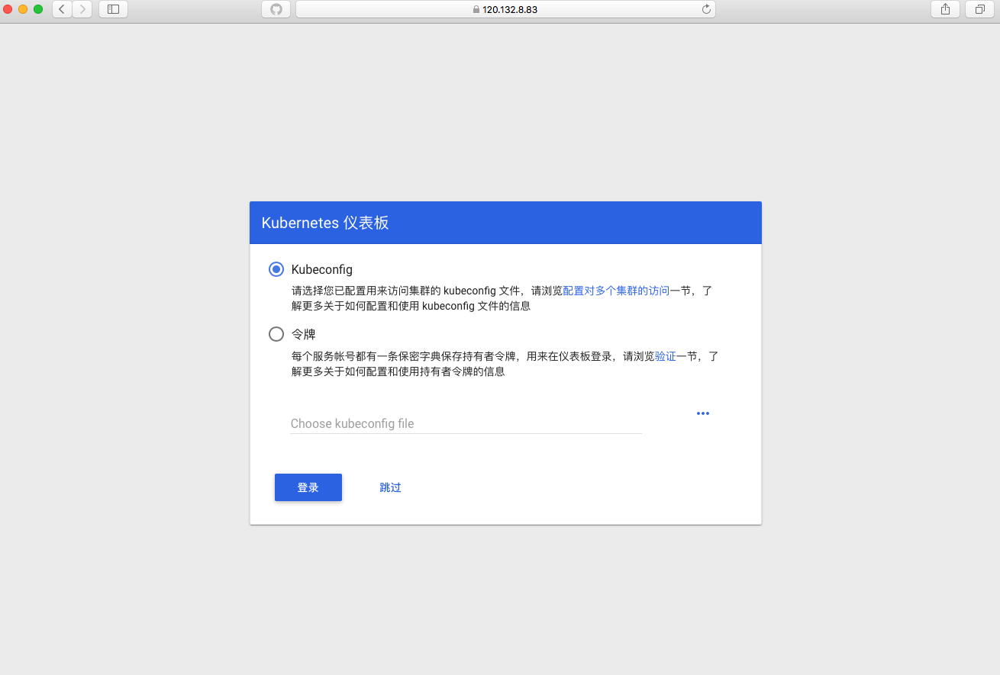
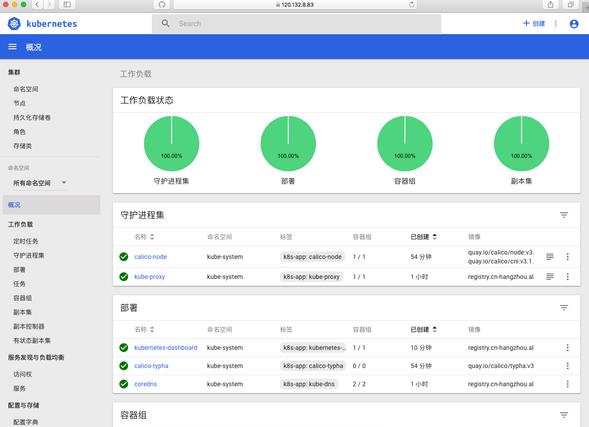

# 部署 kubernetes dashboard 组件


## 安装 kubernetes dashboard
```shell
[root@ks-master k8s]# git clone https://github.com/baishuchao/kubernetes.git
[root@ks-master k8s]# cd kubernetes/kubernets-dashboard/
[root@ks-master kubernets-dashboard]# kubectl apply -f kubernetes-dashboard.yaml
[root@ks-master kubernets-dashboard]# kubectl apply -f dashboard-admin_new.yaml
```

## 通过浏览器访问dashboard




**通过令牌认证**

```
[root@ks-master k8s]# kubectl describe secret `kubectl get secrets -n kube-system |grep admin | awk '{print $1}'` -n kube-system
```


> 注：获取令牌




> 到此为止 dashboard部署完毕，关于dashboard使用说明请参考官方文档！
