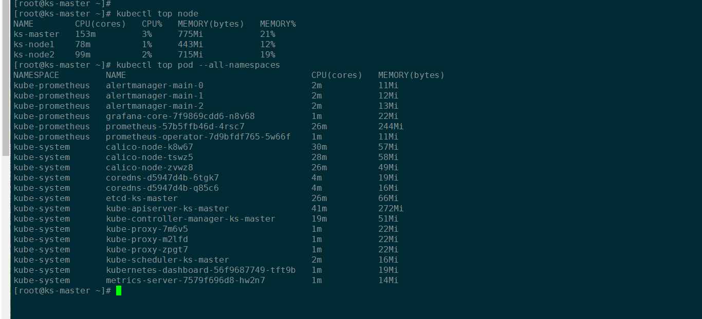

# 部署 metrics-server 组件

## 安装 metrics-server

```
[root@ks-master k8s]# git clone https://github.com/baishuchao/kubernetes.git
[root@ks-master k8s]# cd kubernetes/metrics-server
[root@ks-master metrics-server]#kubectl apply -f .
```

## 验证



